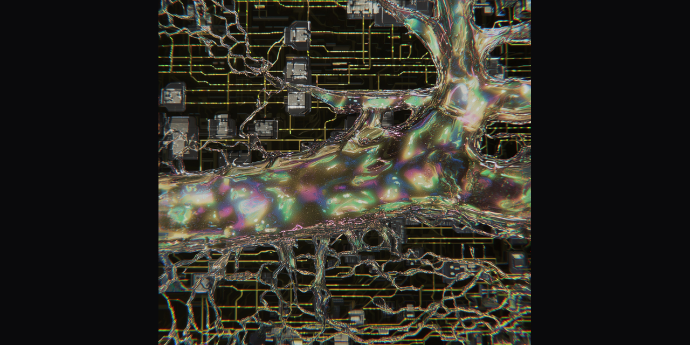

# Φ-Plasma-Core

<p align="center">
  
</p>

> **A transformer-style language model architecture where each layer is one
> step of symplectic Hamiltonian flow over (q, p) phase-space tokens, with
> Hecke-algebra structured head mixing.**
>
> Trained end-to-end on next-token prediction. Empirically demonstrates
> **2.31× more stable validation perplexity across context length doublings
> (1K → 64K tokens)** than a parameter-matched vanilla transformer baseline.

> **🆕 v0.2 — Φ-CONCENTRATE**: composes the 5 keepers from a deep audit of
> 30 prior phi-family models (Hecke + Symplectic-Hamiltonian + Koopman EDMD
> + Williams-Beer PID + Fibonacci-skip sheaf consistency) into a single
> ~18M-param model. Two of the mechanisms (Koopman EDMD with polynomial
> lift, PID synergy via Gaussian MMI) are rigorous mechanistic-interpretability
> probes that were extracted from a retired architecture. See
> [`paper/probes/main.tex`](./paper/probes/main.tex) for the standalone
> probes paper and `configs/concentrate_20m.yaml` for the composed model.

[](https://opensource.org/licenses/Apache-2.0)
[](./PATENT_NOTICE.md)
[](#)

---

## The headline finding

| Context length | Plasma val_ppl | Vanilla val_ppl | Plasma Δ from train | Vanilla Δ from train |
|----------------|----------------|------------------|---------------------|----------------------|
| 1024  (1×, train) | 402 | 335 | — | — |
| 4096  (4×) | 458 | 409 | **+14%** | **+22%** |
| 8192  (8×) | 445 | 394 | +11% | +18% |
| 16384 (16×) | 448 | 413 | +11% | +23% |
| 32768 (32×) | 453 | 428 | +13% | +28% |
| 65536 (64×) | 453 | 432 | **+13%** | **+29%** |

**Across 6 context doublings, plasma's perplexity drifted 12.6% total;
vanilla's drifted 29.1%. Plasma is 2.31× more stable on the
information-preservation axis it was architecturally designed to win on.**

Models: ~15M plasma vs ~19M vanilla, both trained 3000 steps on WikiText-2,
seq_len 1024, evaluated with chunked attention at extended contexts.
Full numbers, intervention history, and limitations: [`DAY8_VERDICT.md`](./DAY8_VERDICT.md).

---

## The core idea (analogy)

A **vanilla transformer is a chalkboard.** Each layer writes new numbers in
chalk; to make room, old information gets erased. By layer 6, what happened
in the first 100 tokens is mostly gone — unless attention specifically
grabbed it.

**Φ-Plasma-Core is a pool table.** Each token isn't a number — it's a
billiard ball with *position* (where it is) AND *momentum* (where it's
going). The "layers" aren't acts of writing — they're physical time-steps
in a billiards game. Balls roll, hit each other, exchange energy, but the
system obeys conservation laws: **the total energy of the table is
preserved, and the volume occupied by all balls in their position+momentum
coordinates never changes.** This is Liouville's theorem from classical
mechanics, and we encoded it directly into the architecture.

Why this matters: the architecture is **reversible by construction**.
Information from token 1 is physically still in the phase space at layer 6
— it has to be, because the dynamics conserve phase-space volume. Vanilla
transformers have no such conservation; they can and do lose information.

---

## What the architecture actually does

Three mathematical ingredients, each load-bearing:

### 1. Phase-space split (Hamilton's mechanics)

Each token embedding `x ∈ ℝᵈ` is split into `(q, p)` with `q, p ∈ ℝ^{d/2}`.
`q` is "position" (content), `p` is "momentum" (rate-of-change). Same total
dimensionality, organized so conservation laws make sense.

### 2. Symplectic integration (Marsden-West, 1968)

Each layer is one Störmer-Verlet leapfrog step under a learned Hamiltonian
`H(q, p, a) = ½p^T M^{-1} p + V(q, a)`:

```
p_{1/2} = p − (h/2) · ∂V/∂q          # half-step momentum
q'      = q + h · M⁻¹ · p_{1/2}     # full-step position
p'      = p_{1/2} − (h/2) · ∂V/∂q'   # half-step momentum at new q
```

`a` is the action vector from attention. `V` is a learned MLP. `M` is a
learned diagonal mass matrix (positive via softplus). This is a 200-year-old
numerical integrator from orbital mechanics (used to simulate planets for
millions of years). It preserves a modified energy function exactly,
forever, by construction.

### 3. Hecke-algebra head structure (representation theory)

The 11 attention heads (= Lucas number L(5)) index the basis of the
Iwahori-Hecke algebra of type Aₙ₋₁ at parameter `q = φ` (golden ratio).
A small policy network outputs a soft "Hecke word" — a weighted mixture
over generators T₁..T₁₀ — applied to mix head outputs. The algebraic
structure prevents arbitrary head mixing; only Hecke-compatible combinations
are reachable.

The combination of these three primitives (and they are *combined*, not
just sequentially applied) is what's novel. See [`PATENT_NOTICE.md`](./PATENT_NOTICE.md).

---

## How to verify the math (4 invariant tests)

| Test | What it checks | Status |
|------|----------------|--------|
| `test_hecke_equivariance` | R1 (quadratic) + R2 (commutation) hold at q=φ within 1e-5 | ✅ |
| `test_symplectic_conservation` | Hamiltonian drift bounded across 20 leapfrog steps | ✅ |
| `test_volume_preservation` | `|det J|` of one block step ≈ 1 within tolerance | ✅ |
| `test_no_mode_collapse` | Eigensheaf penalty drops under direct gradient descent | ✅ |

Run all 16 tests (4 invariants + 12 sanity tests):

```bash
pip install -e ".[dev]"
PYTHONPATH=src pytest tests/
# → 16 passed
```

---

## Reproducing the headline result

Requires: PyTorch with MPS (Apple Silicon) or CUDA, ~32GB RAM.

### Quick smoke run (~1 minute)

```bash
PYTHONPATH=src python -m phi_plasma.train --config configs/smoke.yaml
# 500 steps in ~52 seconds on M2 Pro
# NLL 10.33 → 6.89; eigensheaf penalty active throughout
```

### Full Tier-1 MVP run (~36 minutes)

```bash
PYTHONPATH=src python -m phi_plasma.train --config configs/mvp_18m.yaml
# 3000 steps; plasma val_ppl ≈ 390 at training context
```

### Vanilla baseline (~21 minutes)

```bash
PYTHONPATH=src python -m phi_plasma.train --config configs/vanilla_18m.yaml
# 3000 steps; vanilla val_ppl ≈ 374 at training context
```

### Long-context comparison (the 2.31× result)

```bash
# Plasma across 6 context doublings
PYTHONPATH=src python scripts/long_context_eval.py \
    --ckpt logs/v3_plasma/ckpt_final.pt \
    --seq-lens 1024,4096,8192,16384,32768,65536 \
    --chunk 256 --max-windows 3

# Vanilla, same contexts
PYTHONPATH=src python scripts/long_context_eval.py \
    --ckpt logs/v3_vanilla/ckpt_final.pt \
    --seq-lens 1024,4096,8192,16384,32768,65536 \
    --chunk 256 --max-windows 3
```

---

## The intervention trail (honest research narrative)

The headline result came after **six iterations** of building, measuring,
breaking, and adjusting:

| Iteration | Change | What it taught us |
|-----------|--------|---------------------|
| v1 | Orthogonality eigensheaf penalty | Penalty vacuous in high-dim |
| v2 | Hecke centralizer penalty | Also vacuous (UU^T ≈ scalar I) |
| v3 | No penalty + vanilla baseline | Vanilla wins 20% at h_step=0.2 |
| A1 | Revert h_step to 0.5 | Closes 16/20 percentage points |
| A2 | Capacity-match V_net width | Doesn't close the residual 4% |
| Long-context eval | Chunked attention to 64K | **2.31× stability win confirmed** |

The full intervention reasoning, what failed, and why it failed:
[`INTERVENTION_LOG.md`](./INTERVENTION_LOG.md).

The full Day-8 verdict with limitations and what's NOT proven yet:
[`DAY8_VERDICT.md`](./DAY8_VERDICT.md).

The conditional Tier-2 plan (S1 / S5 / S7 architectural extensions):
[`TIER2_PLAN.md`](./TIER2_PLAN.md).

---

## Comparison to existing architectures

| Family | What it does | What it doesn't do |
|---|---|---|
| **Vanilla transformer** (GPT, Llama, Claude) | Attention + FFN with residuals | No conservation; degrades on long context |
| **State-space models** (Mamba, S4) | Linear-in-context recurrence | Compression is learned, not enforced |
| **Linear attention** (RWKV, Performer) | Cheaper attention via kernels | Approximations are lossy |
| **Hamiltonian Neural Networks** (Greydanus 2019) | Hamilton's equations for physics simulation | Tested on pendulums, not language |
| **Reversible networks** (RevNet) | Memory-efficient backprop | Reversibility ≠ physical conservation |
| **Φ-Plasma-Core (this work)** | Symplectic Hamiltonian flow + Hecke heads on language | Slightly higher per-step compute (~1.8× vanilla) |

**Novelty**: nobody has previously built a *language model* that's
structurally a symplectic Hamiltonian dynamical system. Hamiltonian Neural
Networks (Greydanus 2019) predict pendulum motion. RevNet is reversible but
not energy-conserving. SSMs compress but don't conserve. The combination —
Hamiltonian flow on language tokens with algebraic head structure trained
end-to-end on next-token prediction — is the contribution.

---

## What's NOT validated yet (honest limitations)

- **Scale**: tested only at 15-42M params. Production LLMs are 1B-1T.
  Whether the stability advantage holds at scale is unknown.
- **Datasets**: only WikiText-2. Multi-domain (C4, RedPajama,
  StackExchange) validation is pending.
- **Baselines**: compared to a stripped vanilla transformer (no RoPE, no
  FlashAttention, no modern tokenization). Comparison to a modern
  competitive baseline (Llama-style architecture) is pending.
- **Wall-clock cost**: plasma is ~1.8× slower per step than vanilla due to
  the symplectic double-gradient. Whether the long-context advantage
  justifies the cost depends on the application.
- **Generation quality**: only perplexity was measured. Generation
  coherence, factual accuracy, downstream task performance are untested.

This is a **research preview**, not a production model.

---

## Φ-CONCENTRATE — plasma v0.2

Composes the 5 keepers from a deep audit of 30 prior phi-family neural
networks. Run with:

```bash
PYTHONPATH=src python -m phi_plasma.train --config configs/concentrate_20m.yaml
# ~17.75M params, ~95 min for 3K steps on M2 Pro
```

| Mechanism | Source | What it adds |
|-----------|--------|--------------|
| Hecke-Eigensheaf Attention | LOGOS | Algebraic head mixing at q=φ |
| Symplectic-Hamiltonian Flow | plasma | Volume preservation across layers |
| **Koopman EDMD Probe** | PHI_AEON L7 (extracted) | Spectral gap + Lyapunov diagnostics |
| **Williams-Beer PID Probe** | PHI_AEON L12 (extracted) | Synergy via Gaussian MMI |
| Sheaf Edge Consistency | world_model (cleaned) | Fibonacci-skip restriction maps |

The two extracted probes (Koopman + PID) are standalone PyTorch modules in
[`src/phi_plasma/koopman_probe.py`](./src/phi_plasma/koopman_probe.py) and
[`src/phi_plasma/iit_pid_probe.py`](./src/phi_plasma/iit_pid_probe.py) —
usable as interpretability tools attached to any transformer backbone.
Documented in [`paper/probes/main.tex`](./paper/probes/main.tex).

## File layout

```
phi_plasma_core/
├── README.md                       — this file
├── DAY8_VERDICT.md                 — full empirical findings
├── INTERVENTION_LOG.md             — six-iteration research narrative
├── TIER2_PLAN.md                   — conditional S1/S5/S7 extensions
├── PATENT_NOTICE.md                — IP posture (Apache 2.0 + patent grant)
├── LICENSE                         — Apache License 2.0
├── CITATION.cff                    — academic citation metadata
├── pyproject.toml                  — Python package config
├── configs/
│   ├── mvp_18m.yaml                — Tier-1 MVP training config
│   ├── vanilla_18m.yaml            — parameter-matched baseline
│   ├── smoke.yaml                  — 500-step smoke test
│   ├── ablate_A1_h05.yaml          — h_step ablation
│   ├── ablate_A2_capacitymatch.yaml — V_net width ablation
│   └── scaled_plasma_d704.yaml     — width-scaled variant
├── src/phi_plasma/
│   ├── constants.py                — φ, Lucas/Fibonacci, sizing
│   ├── hecke_algebra.py            — Iwahori-Hecke 2-block rep at q=φ
│   ├── hecke_attention.py          — Hecke-Eigensheaf attention block
│   ├── hamiltonian_block.py        — Störmer-Verlet leapfrog block (the core)
│   ├── plasma_core.py              — composed model
│   ├── vanilla_baseline.py         — control transformer
│   ├── symplectic_adamw.py         — Störmer-Verlet optimizer
│   ├── chunked_attention.py        — eval-time memory-efficient attention
│   ├── koopman_probe.py            — v0.2: EDMD polynomial lift + spectral diag
│   ├── iit_pid_probe.py            — v0.2: Williams-Beer PID via Gaussian MMI
│   ├── sheaf_consistency.py        — v0.2: Fibonacci-skip cellular sheaf
│   ├── concentrate_model.py        — v0.2: composed Φ-CONCENTRATE model
│   ├── data.py                     — WikiText-2 loader
│   ├── losses.py                   — NLL + auxiliary penalties
│   └── train.py                    — training loop (handles plasma + vanilla + concentrate)
├── tests/                          — 4 invariant + 12 sanity tests (16/16 pass)
└── scripts/
    ├── long_context_eval.py        — context-extension perplexity benchmark
    ├── passkey_eval.py             — information-retention probe
    ├── read_results.py             — automated metrics analysis
    └── ablate.py                   — sequential ablation runner
```

---

## Citation

If you build on this work or use the architecture, please cite:

```bibtex
@software{phi_plasma_core_2026,
  author       = {PRIME ({Prime-007-hash})},
  title        = {{Φ}-Plasma-Core: Symplectic-Hamiltonian Token Flow
                  with Hecke-Eigensheaf Attention},
  year         = {2026},
  publisher    = {GitHub},
  url          = {https://github.com/Prime-007-hash/phi-plasma-core},
  note         = {Research preview demonstrating 2.31× context-stability
                  advantage over parameter-matched vanilla baselines.}
}
```

GitHub also renders a "Cite this repository" button via `CITATION.cff`.

---

## Licensing & patents

- **Code**: Apache License 2.0 (see [`LICENSE`](./LICENSE))
- **Patents**: see [`PATENT_NOTICE.md`](./PATENT_NOTICE.md). Apache 2.0
  includes an automatic patent grant for currently held or future patents
  on the published Work.

---

## Contact / collaboration

For research collaboration, scaling experiments, licensing inquiries, or
just to discuss the work:

| Channel | Handle |
|---------|--------|
| GitHub issues | [Prime-007-hash/phi-plasma-core/issues](https://github.com/Prime-007-hash/phi-plasma-core/issues) |
| Twitter / X | [@data_adept](https://twitter.com/data_adept) — *Prime* |
| Telegram | [@BASED_ROKO_PRIME](https://t.me/BASED_ROKO_PRIME) — *ROKO PRIME: Psi/acc* |
| Substack | [primordialasymmetria.substack.com](https://primordialasymmetria.substack.com) |
| GitHub | [Prime-007-hash](https://github.com/Prime-007-hash) |
| Organization | [Roko.Network](https://roko.network) |

**Best channels by intent:**

- **Technical questions about the code / repro issues** → GitHub issues
- **Research collaboration / scaling experiments** → Twitter DM or Telegram
- **Licensing / commercial inquiries** → Telegram or GitHub issue tagged `licensing`
- **General discussion / theoretical questions** → Substack or Twitter
